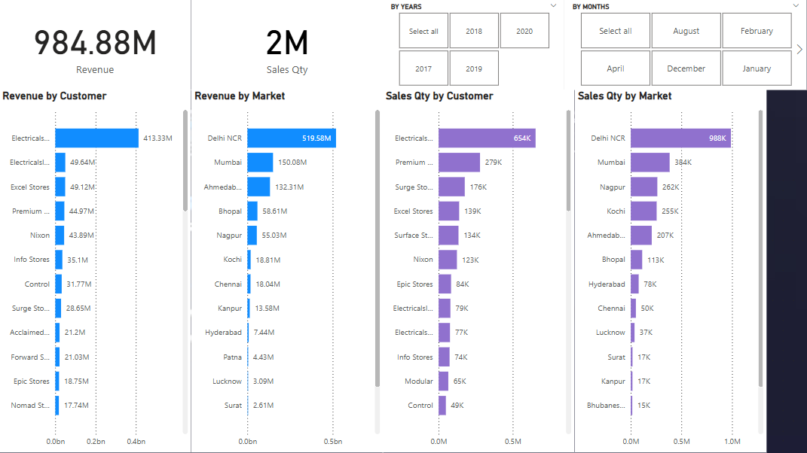
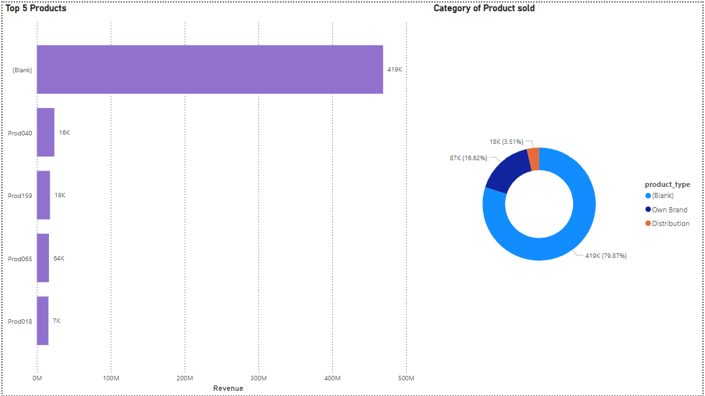
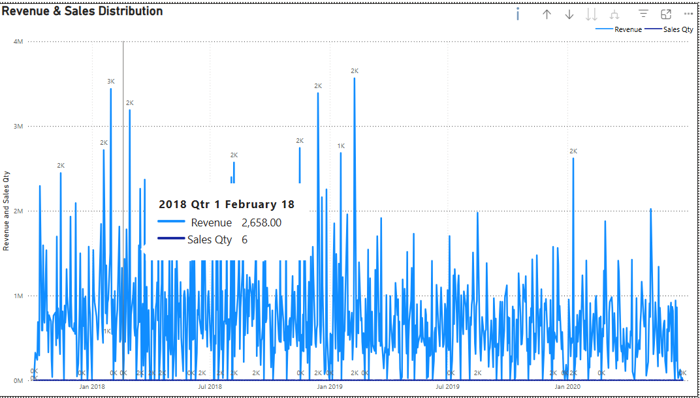

# 📊 Sales Dashboard - Power BI Project

This project features an interactive and dynamic **Sales Dashboard** built using **Power BI**. The underlying data was sourced from a MySQL database, queried using **MySQL Workbench**, and then modeled, cleaned, and visualized in Power BI using DAX measures and calculated columns.

---

## 📁 Dataset

The data was imported from a structured **MySQL database** (see `db_dump.sql`). It includes information related to:

- Sales transactions
- Products and categories
- Customer details
- Dates and order timelines

---

## 📚 Data Source

This project's data was sourced from the [Sales Insights Project](https://codebasics.io/resources/sales-insights-data-analysis-project) by [Codebasics](https://codebasics.io/).  
The original database dump (`db_dump.sql`) is publicly available for educational and non-commercial use.

---

## 📌 Key Features

- 📅 **Monthly Sales Trends** – Time-series breakdown of revenue across months
- 🛒 **Top Performing Products** – Based on total sales and order frequency
- 🌍 **Geographical Sales Insights** *(if included in your data)*
- 📈 **Category-wise Revenue Analysis**
- 🎯 **KPIs** – Total Sales, Number of Orders, Average Order Value, Repeat Customers, etc.
- 📊 **Interactive Filters** – Slicers by category, product, date range, and customer

---

## 🛠 Tools & Technologies Used

- **Power BI Desktop**
- **MySQL Workbench** (for querying the database)
- **DAX (Data Analysis Expressions)** for calculated fields and measures

---

## 🧠 Challenges Faced

- Exploring and mastering Power BI’s canvas layout for professional storytelling
- Writing efficient and accurate **DAX formulas** to generate metrics
- Designing a dashboard that is **visually intuitive** and **analytically rich**

---

## 💡 Learnings

This project enhanced my understanding of data visualization best practices, efficient data modeling, and the power of combining SQL with BI tools to extract interactive business insights.

---

## 📂 Project Structure

```text
├── Sales-Dashboard.pbix           # Power BI file
├── db_dump.sql                    # MySQL database dump file
└── README.md                      # Project overview
```

---

### 📊 Dashboard Overview

#### 📌 Page 1 – Overall Performance and Distribution


#### 📌 Page 2 – Top Performing Products and Category Sold


#### 📌 Page 3 – Revenue & Sales Distribution Over Time


---
